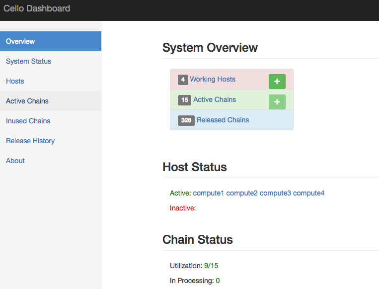
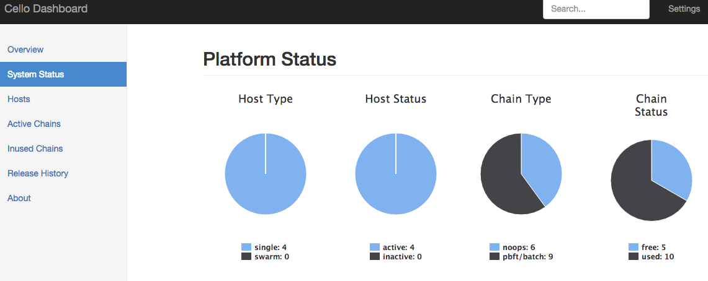
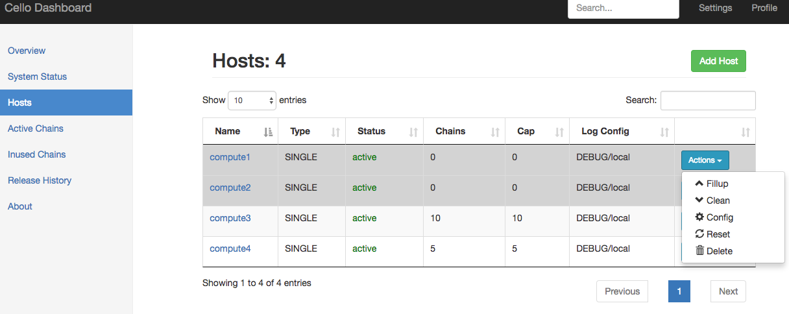
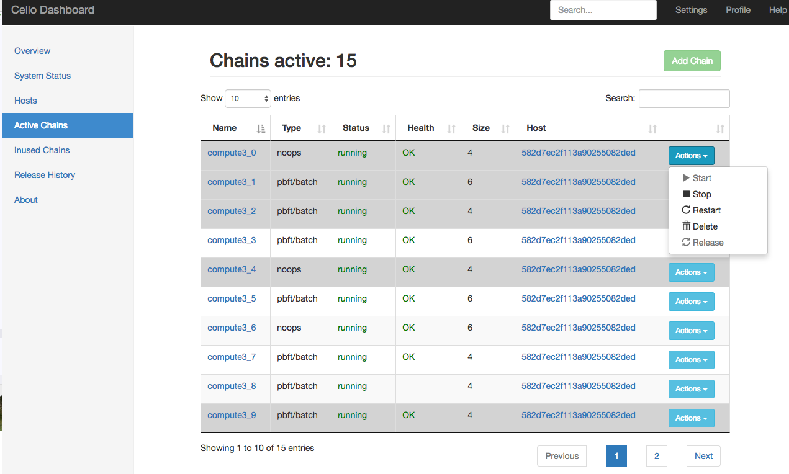

# Dashboard for Operator

By default, the operator dashboard will listen on port `8080` at the Master Node, and operators can login in with default `admin:pass` credential.

The left panel gives quick link to various functions, including `overview`, `system status`, `Hosts`, `Active Clusters`, `Inused Clusters`, `Release History` and `About`.

| Name | URL | Function |
| --- | --- | --- |
| Overview | `/index` | See a high-level overview on system status |
| System Status | `/stat` | See statistics on the system |
| Hosts | `/hosts` | Operate on the hosts managed by the system |
| Active Clusters | `/clusters?type=active` | Operate on existing running chains in the pool |
| Inused Clusters | `/clusters?type=inused` | Operate on user occupied chains in the system |
| Released History  | `/clusters?type=released` | See cluster releasing history data |

## Overview

The default overview page show the overall status of the system, e.g., how many hosts are deployed within the system, how many clusters are running on those hosts. And there are status numbers for both hosts and clusters.

## System Status Page

The system status page shows the host and cluster statistics in terms of types and active/inactive in the system.

## Hosts

In Host page, you can manage all the existing hosts in the pool, and add new hosts. The host shows its `Type` (e.g., SINGLE for Native Docker, or SWARM for Docker Swarm), `Status` (active or not) , `Chains` (How many chains running in the host), `Cap` (Capacity) and `Log Config` (level, receiver). Those non-schedulable host will have a grey line

In the Action dropdown menu, you can

* Fillup: Fill a host with chains till it's full `capacity`.
* Clean: Clean all unused chains at the host.
* Config: Set configurations of the host, e.g., `name` or `capacity`.
* Reset: Reset everything on the host, useful when u meet problems of running chains on the host. Notice a host can be `reset` only when there's no inused chains on it.
* Delete: Remove the host from the pool, then the system will not care about it.

### Add Host

You can click the `Add Host` button to add more hosts into the pool.

## Active Chains

The `Active Chains` page shows all existing running chains in the system, with their Name, Type, Status, Health, Size and Host. Those inused chains will have a grey line.

In the Action dropdown menu, you can

* Start: Start a chain that is not running.
* Stop: Stop a running chain to stopped status.
* Restart: Restart a chain.
* Delete: Delete the chain.
* Release: Release a user-occupuied chain back to the pool, which will be deleted later.

You can click the `Add Chain` button to add more chains into the pool if there are non-full hosts.

## Inused Chains

Filter out those running chains that are occupied by users.

## Release History

Record all the user releasing chain history.

 This work is licensed under a <a rel="license" href="http://creativecommons.org/licenses/by/4.0/">Creative Commons Attribution 4.0 International License</a>.